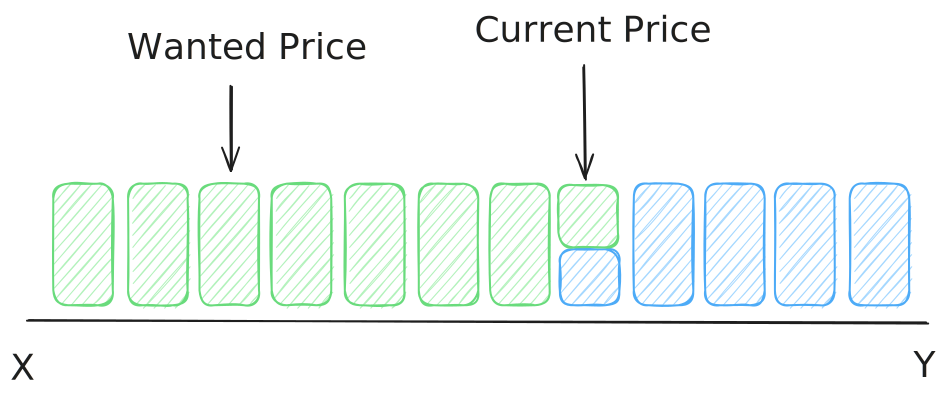

### *Investment Disclosure:*
*This article will be discussing FusionAMM, a protocol created, owned and operated by DeFiTuna. As the author of this article I have personally been involved in the community for over half a year and have made substation investments into their token $TUNA. I do not wish for this breakdown to come across as "shilling" or confirmation bias (that's what X is for). I will not mention anything other than the FusionAMM architecture any further. Any comparisons to other protocols are made solely for context and carry no intent of promotion or criticism.*

This article will assume basic knowledge of how order books and liquidity pools work. I recommend reading [my liquidity pool article](https://www.jsteagle.dev/blog/Liquidity_Pools_-_The_Core_of_DeFi_as_we_know_it) if you aren't familiar with these concepts.

### The Problem
Liquidity pools are great! They have a bunch of really cool features and allow for a **ton** of cool use cases that wouldn't be possible without them. But traditional order books still have one feature that [LPs|Liquidity Pools] don't. Limit orders.

> A **limit order** is an order to buy or sell an asset at a specific price or better. It guarantees the price, but not that the trade will be executed.

Order books are good at these.... because that's all they are. A set of limit orders. If you want to buy or sell **right now**, you have to pick the best limit order in the book and use that as the counter party to your trade. Liquidity pools are really good at this kind of order because of how they keep track of price and handle orders. But if you want to set an order to execute at a certain price in a liquidity pool. Things get a bit trickier.

The image above is showing a simplified visualisation of what a LP of SOL-USDC might look like at some price. As you can see, the current price is not where we want to trade. LPs however, don't allow you to trade anywhere, they only allow **tokens in** and **tokens out**. Under the hood they keep track of what the current ratio of tokens is (the price) and how it should change as tokens get added or removed.

Now that we have established that you can't create limit orders on LPs. Lets go to [Jupiter](https://jup.ag/swap?sell=EPjFWdd5AufqSSqeM2qN1xzybapC8G4wEGGkZwyTDt1v&buy=So11111111111111111111111111111111111111112) and create limit orders on LPs....

Doesn't seem right, does it? It looks like a limit order. Quacks like a limit order. But is it actually a limit order? The short answer is: **"No"**. But that doesn't make for a good article. So let's dig deeper into what is actually happening.

