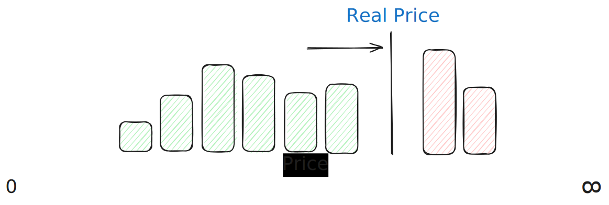
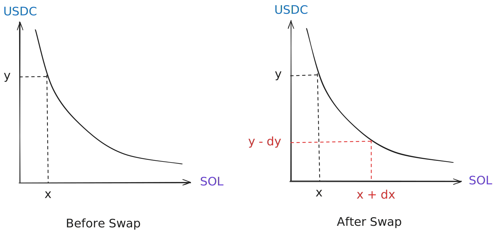

A lot of Decentralized finance (DeFi) protocols or infrastructure can seem very futuristic and most of all **very** complicated. On the one hand this is because they are often a fusion of traditional finance principles along with math and computer science. But on the other hand, it's also easier to get people to invest into your coin when you call it a *"Algorithmic Stablecoin with Seigniorage-Based Elastic Supply"* instead of *"When price go up, we make more coins. When price go down, we destroy more coins."*

This article is meant to build intuition and build up the understanding to help demystify Automatic Market Makers (AMMs) also known as Liquidity Pools (LPs), the building block of DeFi as we know it. To do that we will cover the following:
- What is a Market Maker?
- What is a LP?
- What makes LPs better than a traditional Market Maker?
- What are some different kinds of LPs and how do they work?
	- Standard LP
	- Concentrated LP (CLMM)
	- Dynamic LP (Constant Product AMM)

### Market Makers
In traditional finance (TradFi) there are 2 main ways in which assets get traded. Over the Counter (OTC) or through an Order Book. OTC orders are pretty self explanatory. Someone makes an offer to either buy or sell and *usually* anyone can accept that offer and provide the other side of the trade.

Order books are where it gets interesting. An order book is just a record of all the [limit orders|Limit orders are buy or sell orders set to execute at a specific price or better] that are open. A trader that puts in an order on either side is called a **maker** and a trader that trades against that order is called a **taker**.

Above is a simplified example of what a theoretical order book for Solana (SOL) might look like. Note that the *real* price of SOL at this time would be somewhere between 150 and 151. This is because an order book has no indication of what the actual price of SOL is, it only contains a list of orders to execute if the price is at the limit or [better|In this context "better" means that for buy side orders, the price is at or lower than the limit. And for sell side orders the price is at or above the limit].

A Market Maker is a trader that places both buy and sell side limit orders within a small range of where the *real* price is. This range is called the [spread|Spread is defined as the highest bid price and the lowest ask price in an order book also called the cost of immediate execution]. This spread is what makes traditional market making profitable. Any trader who wants to sell SOL [spot|A Spot or Market Order is just an instruction to execute a trade for some amount of money at the best price immediately] will lose a small amount of money by not selling at the *real* price due to the spread of the market maker. This is called **slippage**.

In our simple orderbook example, we can think of the price of SOL as this imaginary line that goes from 0 to $\infty$. And limit orders as buckets of [liquidity|Simply put: The amount of buy and sell volume available through limit orders at a time (I will elaborate on this more soon)] placed along the way. As these buckets of liquidity get emptied, takers (the active buyers or sellers) need to move further up and down the line to get their orders filled. Of course in reality market makers constantly replenish their offers to always give takers an offer while maintaining their spread. And so as price moves up and down depending on the supply and demand of either side, so does the order book.

### Automatic Market Makers
With the rise of DeFi and blockchain technology the first Decentralised Exchanges (DEXs) started to appear. But they had some key issues with their order books:
1. **High gas fees** for orders
2. **Slow execution** due to Ethereum block times
3. **Front-Running risks** because pending orders were visible in the [mempool|This isn't important to the article, it just means that pending orders were visible to everyone else]
As a result DEX trading was clunky, expensive, and illiquid.

So in 2018 a breakthrough was made by the [Uniswap](https://app.uniswap.org/) team.
> Instead of matching buyers and sellers, **let traders interact with a pool of assets using a pricing formula**

This is genius because it removes the need for *active* makers to support price, allows anyone to *passively* contribute to an asset pairs liquidity and it was fully on-chain and gas-efficient.

Above is a visualisation for what a simple **constant product AMM** looks like. Don't worry, it looks *mathy* but it's really not that bad. A **constant product AMM** is simply a [pool|Pools are represented on-chain in various different fashions but that isn't relevant to the scope of this article] that keeps one simple rule. The amount of token $X$ multiplied by the amount of token $Y$ is always a constant $K$. This just means that when a swap happens, the amount of the opposite token a user gets out of the swap is determined by this simple rule $X\times Y = K$. This constant $K$ is just a measure of how much liquidity there is in the pool. So as more tokens get added, the amount the price changes by the same amount of tokens swapped changes.
> This is why you often hear that you should be aware of tokens with low liquidity. As this means that a trade of \$100 will a token with low liquidity much more than a token with a lot of liquidity

$

